<div align="center">


<br>

[](https://geekpoint.com.mx)


<br>


<br>


<table>
  <thead>
    <tr>
      <th colspan="2" style="background-color: #007FFF; color: white; text-align: center;">Idioma</th>
    </tr>
    <tr>
      <th style="background-color: #007FFF; color: white; text-align: center;">English</th>
      <th style="background-color: #007FFF; color: white; text-align: center;">Español</th>
    </tr>
  </thead>
  <tbody>
    <tr>
      <td align="center"></td>
      <td align="center"></td>
    </tr>
  </tbody>
</table>

<br>

<a href="#mascota"></a>
<a href="#descripcion"></a>
<a href="#funcionalidades"></a>
<a href="#roles"></a>
<a href="#sucursales"></a>
<a href="#tecnologia"></a>
<a href="#capturas"></a>
<a href="#equipo"></a>
<a href="#instalacion"></a>

<br><br>

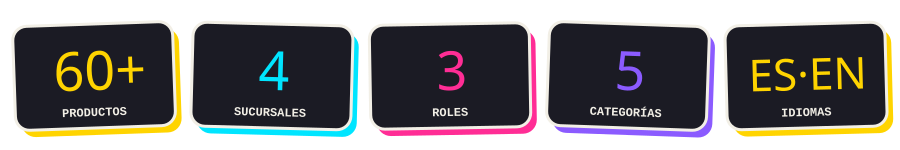

</div>


<a name="mascota"></a>

<div align="center">

## 🐾 La mascota de GeekPoint

*Ella vive dentro de un manga. Esta es la primera página de su historia.*


<br><br>


<sub>Diseño original de <b>Fernanda Sofía Ayala Oliva</b>.</sub>

</div>


<a name="descripcion"></a>


<p align="center">
  <a href="https://geekpoint.com.mx" target="_blank">
    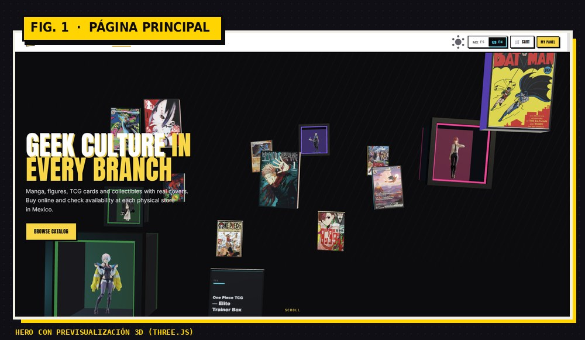
  </a>
  <br>
  <b>👉 <a href="https://geekpoint.com.mx">geekpoint.com.mx</a></b>
</p>

**GeekPoint** es una aplicación web de **punto de venta e inventario multisucursal** para tiendas de cultura geek en México. Une un catálogo e-commerce de **mangas, figuras, cómics y cartas TCG** (con portadas reales) con un sistema de ventas donde **cada sucursal maneja su propio stock**.

* 🛍️ Tienda pública con catálogo filtrable, buscador, carrito y previsualización 3D de productos.
* 🏬 Disponibilidad por sucursal en cada producto.
* 🧾 Punto de venta para cajeros con IVA, método de pago y ticket automático.
* 📊 Paneles de Administrador y Gerente con ventas, alertas y desempeño.
* 🌎 Interfaz en español e inglés, con tema oscuro y claro.

> 🎓 **Proyecto Integrador** de Ingeniería de Software · Universidad de Colima, Facultad de Ingeniería Electromecánica · semestre agosto 2026 – enero 2027.

<p align="center">
  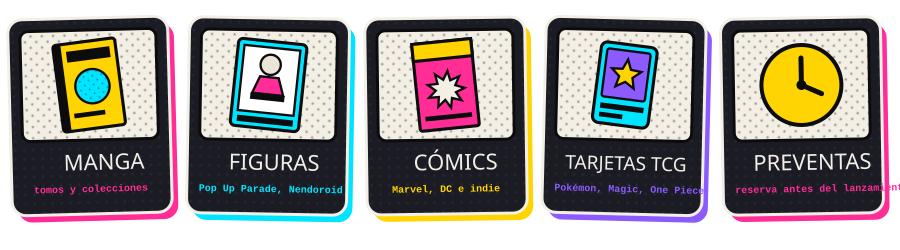
</p>


### 📌 Problemática

Las tiendas geek con varias sedes suelen llevar inventario y ventas de forma desconectada, lo que provoca:

- Inventarios desactualizados entre sucursales.
- Clientes que no saben si un producto está disponible en su ciudad.
- Ventas en caja sin un registro centralizado ni tickets uniformes.
- Poca visibilidad para quien administra la red completa.

### 🎯 Objetivo general

Desarrollar una plataforma web que unifique **catálogo en línea, inventario por sucursal y punto de venta**, con roles diferenciados y una experiencia visual a la altura de la cultura geek.

### 🧩 Objetivos específicos

- Mantener un inventario independiente por sucursal.
- Registrar ventas en caja con subtotal, IVA, método de pago y ticket con folio.
- Dar a Administrador y Gerente paneles con ventas, alertas de stock y desempeño.
- Ofrecer una interfaz bilingüe (ES / EN), responsiva y con vista 3D de productos.
- Obtener portadas reales de manga y cómics mediante la API de Jikan (MyAnimeList).


<a name="funcionalidades"></a>


<table>
  <thead>
    <tr>
      <th style="background-color: #007FFF; color: white; text-align: center;">Funcionalidad</th>
      <th style="background-color: #007FFF; color: white; text-align: center;">Descripción</th>
    </tr>
  </thead>
  <tbody>
    <tr><td><b>🛍️ Catálogo</b></td><td>Más de 60 productos reales en Manga, Figuras, Cómics, Tarjetas TCG y Preventas, con filtro en tiempo real.</td></tr>
    <tr><td><b>🔎 Buscador</b></td><td>Búsqueda por nombre, SKU o categoría, en la tienda y en el punto de venta.</td></tr>
    <tr><td><b>🧊 Vista 3D</b></td><td>Previsualización interactiva de productos con Three.js.</td></tr>
    <tr><td><b>🛒 Carrito</b></td><td>Agregar productos, ajustar cantidades y total en tiempo real. Opera en modo demostración: la acción final es <i>reservar</i>, sin cobros reales.</td></tr>
    <tr><td><b>🏬 Inventario por sucursal</b></td><td>Cada sede tiene su propio stock; cada venta lo actualiza automáticamente.</td></tr>
    <tr><td><b>🧾 Punto de venta</b></td><td>Venta actual con subtotal, IVA y total; selección de caja; pago en efectivo, tarjeta o transferencia.</td></tr>
    <tr><td><b>🎫 Ticket</b></td><td>Folio, fecha, sucursal, cajero, productos, totales, método de pago y cambio, con opción de imprimir.</td></tr>
    <tr><td><b>📊 Paneles</b></td><td>Administrador y Gerente con ventas del día y del mes, alertas de stock, gráfica de 14 días y más vendidos.</td></tr>
    <tr><td><b>👥 Usuarios y sucursales</b></td><td>Alta, edición, pausa y baja de sucursales; cuentas con rol y sucursal asignada.</td></tr>
    <tr><td><b>🌎 Idioma y tema</b></td><td>Español / inglés y modo oscuro / claro desde la barra superior.</td></tr>
  </tbody>
</table>

<p align="center">
  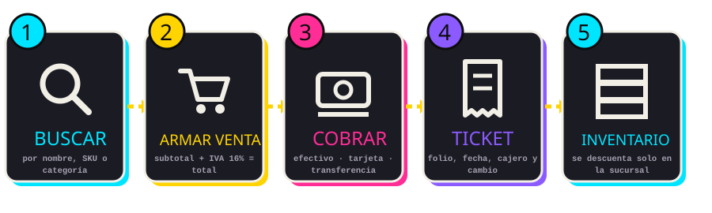
</p>


<a name="roles"></a>


El sistema tiene **tres roles**. Cada gerente y cada cajero queda asignado a una sucursal, y el Administrador ve toda la red.

<p align="center">
  
</p>


<a name="sucursales"></a>


Cuatro sedes reales, cada una con su clave, ciudad, horario e inventario propio.

<p align="center">
  
</p>


<a name="tecnologia"></a>


<p align="center">
  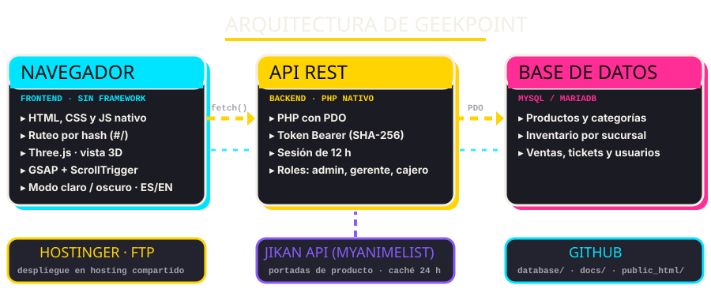
</p>

| Capa | Tecnología | Para qué |
| :--- | :--- | :--- |
| **Frontend** | HTML, CSS y JavaScript nativo | Interfaz sin framework, ruteo por hash (`#/`) |
| **3D y movimiento** | Three.js · GSAP + ScrollTrigger | Vista previa 3D de productos y animaciones de scroll |
| **Backend** | PHP nativo con PDO | API REST con token Bearer (SHA-256), sesión de 12 h |
| **Base de datos** | MySQL / MariaDB | Productos, inventario por sucursal, ventas y usuarios |
| **Integración** | Jikan API (MyAnimeList) | Portadas de producto, con caché local de 24 h |
| **Despliegue** | Hostinger por FTP | Hosting compartido |
| **Control de versiones** | Git / GitHub | Código, base de datos y documentación |


<a name="capturas"></a>


<p align="center">
  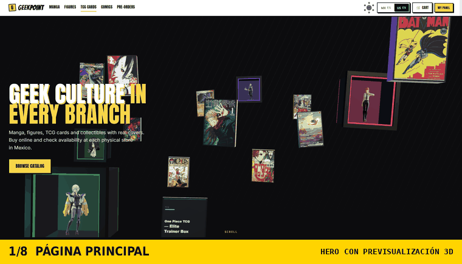
</p>

<table>
  <tr>
    <td width="50%">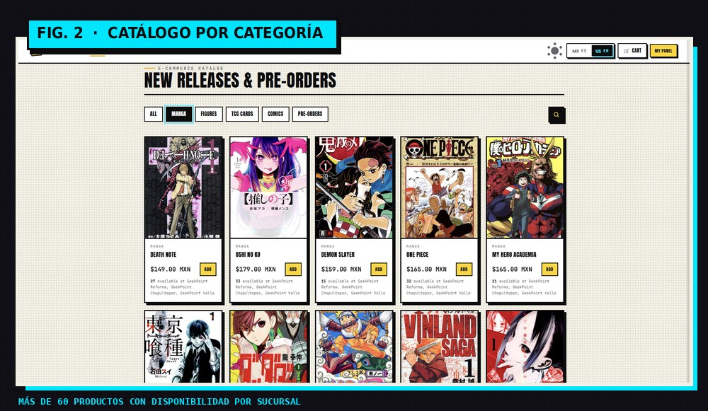</td>
    <td width="50%">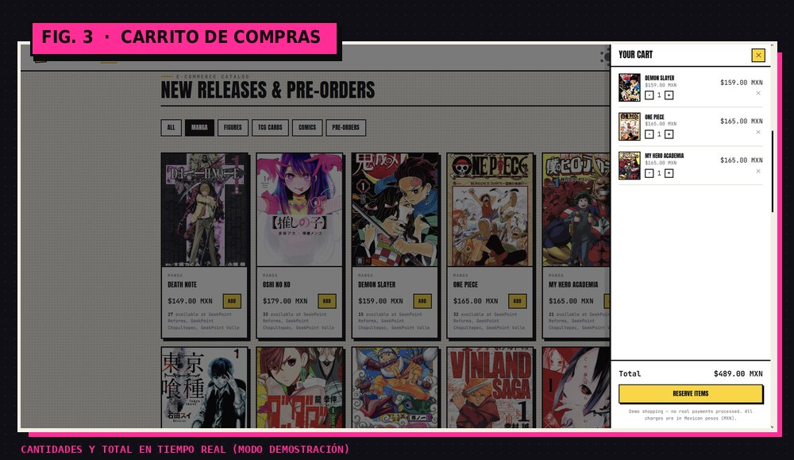</td>
  </tr>
  <tr>
    <td width="50%">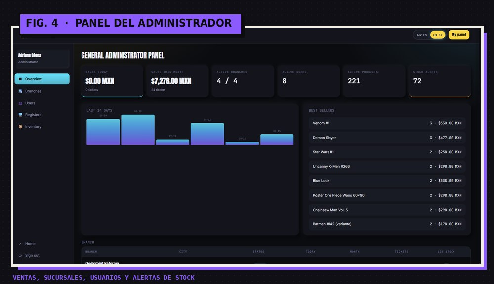</td>
    <td width="50%">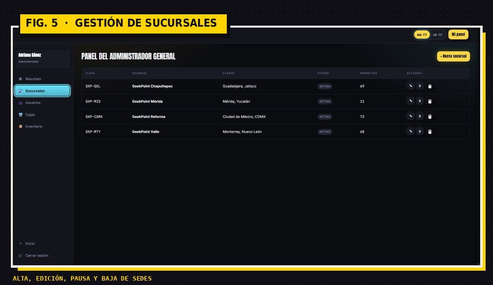</td>
  </tr>
  <tr>
    <td width="50%">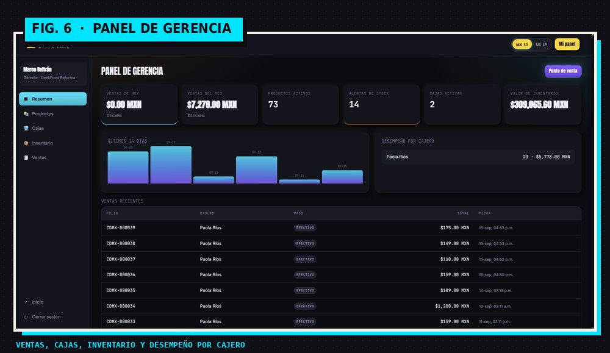</td>
    <td width="50%">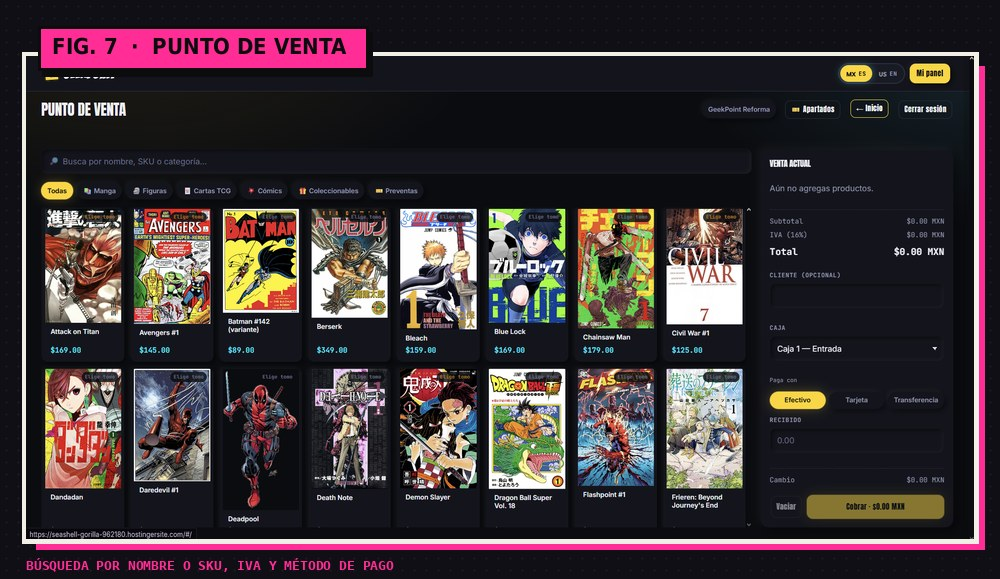</td>
  </tr>
  <tr>
    <td colspan="2" align="center">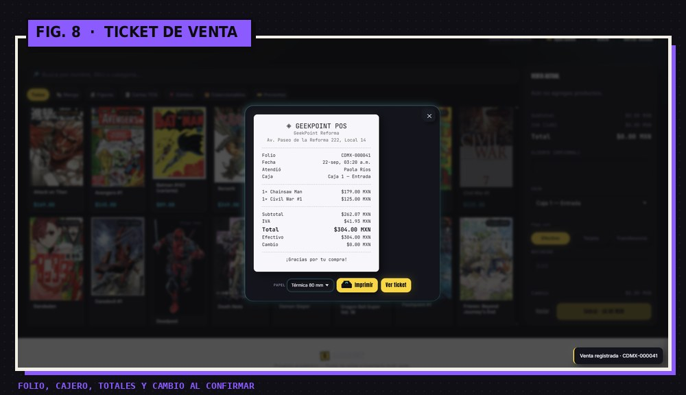</td>
  </tr>
</table>


<p align="center">
  
</p>

### 🧭 Hacia la Fase 3

- [ ] Pulir el inicio de sesión y decidir sobre el sistema de apartados de usuario.
- [ ] Completar el manual técnico y el manual de usuario.
- [ ] Pruebas integrales por rol (Administrador, Gerente y Cajero).
- [ ] Optimizar inventario y alertas; depurar datos de prueba.
- [ ] Reporte final, artículo IEEE y video comercial.


<a name="equipo"></a>


**Universidad de Colima — Facultad de Ingeniería Electromecánica**<br>
**Ingeniería de Software · 3.er semestre, Grupo E**<br>
**Tutor de equipo:** Mtro. Emilio Ballinas Arteaga

<table align="center">
  <tr>
    <td align="center" width="20%"><a href="https://github.com/ZaekoRam"></a><br><b>José Carlo<br>Ramírez Bacelis</b><br><sub>Scrum Master · Líder<br>Panel admin e inventario por sucursal</sub><br><a href="https://github.com/ZaekoRam">@ZaekoRam</a></td>
    <td align="center" width="20%"><a href="https://github.com/Cake-marco"></a><br><b>Marco Antonio<br>Yáñez González</b><br><sub>Investigación de BD<br>Login interactivo y base de datos</sub><br><a href="https://github.com/Cake-marco">@Cake-marco</a></td>
    <td align="center" width="20%"><a href="https://github.com/Fernanda-Sofia"></a><br><b>Fernanda Sofía<br>Ayala Oliva</b><br><sub>Diseño conceptual<br>Mascota y vista 3D</sub><br><a href="https://github.com/Fernanda-Sofia">@Fernanda-Sofia</a></td>
    <td align="center" width="20%"><a href="https://github.com/accithecat"></a><br><b>Ernesto<br>Carmona Medina</b><br><sub>Documentación técnica<br>Descuentos y promociones</sub><br><a href="https://github.com/accithecat">@accithecat</a></td>
    <td align="center" width="20%"><a href="https://github.com/kyo1608"></a><br><b>Frida Natalia<br>Serrano Murillo</b><br><sub>Documentación de usuario<br>Ventas en caja y pruebas</sub><br><a href="https://github.com/kyo1608">@kyo1608</a></td>
  </tr>
</table>


<a name="instalacion"></a>


### 💻 Requisitos

| Requisito | Versión recomendada |
|---|---|
| PHP | 8.0 o superior |
| MySQL / MariaDB | 5.7 / 10.4 o superior |
| XAMPP / Laragon | Última versión |
| Navegador | Chrome, Edge o Firefox |

### ⚙️ Pasos

1. **Clona el repositorio**
```bash
git clone https://github.com/ZaekoRam/GeekPoint.git
cd GeekPoint
```

2. **Crea la base de datos** e importa los scripts de la carpeta `database/` desde phpMyAdmin o la terminal.
```sql
CREATE DATABASE geekpoint CHARACTER SET utf8mb4;
```

3. **Configura la conexión** (host, usuario, contraseña y nombre de la BD) en el archivo de configuración del backend dentro de `public_html/`.

4. **Sirve `public_html/`** desde tu servidor local (`htdocs` en XAMPP o `www` en Laragon) y abre `http://localhost/GeekPoint/public_html/`.

<!-- AJUSTA los pasos 2–4 a los nombres reales de tus archivos de configuración y SQL -->


<a name="estructura"></a>


```text
GeekPoint/
├── 📁 database/       # Scripts SQL de la base de datos
├── 📁 docs/           # Documentación: protocolo, reportes y manuales
├── 📁 public_html/    # Sitio completo (frontend + API en PHP) que se sube al hosting
└── README.md
```


### 🙌 Créditos

- Proyecto Integrador de Ingeniería de Software, Universidad de Colima.
- Gracias al **Mtro. Emilio Ballinas Arteaga** y a los profesores participantes por su guía y retroalimentación.
- Mascota y diseño conceptual por **Fernanda Sofía Ayala Oliva**.
- Portadas de manga y cómics obtenidas con la [Jikan API](https://jikan.moe/).
- Diseño del README: cómic y manga, igual que el sitio.

### 📜 Licencia

Este proyecto se distribuye bajo la licencia **MIT**: puedes usar, estudiar, modificar y compartir el código, siempre que se incluya el crédito a los autores originales.

<p align="center">
  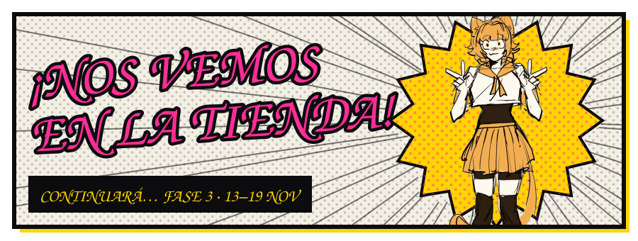
</p>
