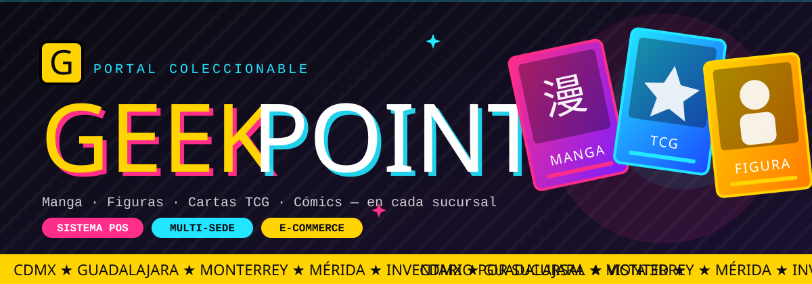
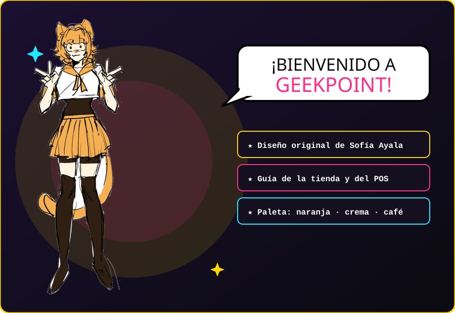
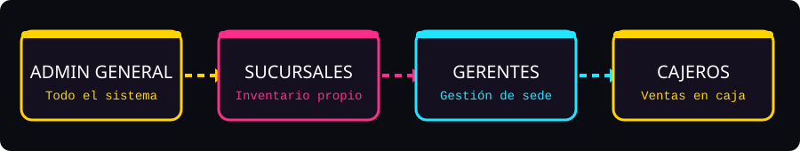

<div align="center">



<br>

[](https://geekpoint.com.mx)


<br>


<br>


<table>
  <thead>
    <tr>
      <th colspan="2" style="background-color: #007FFF; color: white; text-align: center;">Idioma</th>
    </tr>
    <tr>
      <th style="background-color: #007FFF; color: white; text-align: center;">English</th>
      <th style="background-color: #007FFF; color: white; text-align: center;">Español</th>
    </tr>
  </thead>
  <tbody>
    <tr>
      <td align="center"></td>
      <td align="center"></td>
    </tr>
  </tbody>
</table>

</div>


## 🐾 Conoce a la mascota

<p align="center">
  
</p>


## 🌐 Sitio web

<p align="center">
  <a href="https://geekpoint.com.mx" target="_blank">
    
  </a>
  <br>
  <b>👉 <a href="https://geekpoint.com.mx">geekpoint.com.mx</a></b>
</p>

**GeekPoint** es un portal coleccionable y sistema POS multi-sede para tiendas físicas de cultura geek en México. Combina un catálogo e-commerce de **mangas, figuras, cartas TCG y cómics** (con portadas reales) con un sistema de ventas e inventario donde **cada sucursal maneja su propio stock**.

* Catálogo en línea con filtros por categoría, novedades y preventas.
* Disponibilidad por sucursal en tiempo real.
* Vista previa 3D de los productos.
* Panel de administración, inventario por sucursal y caja registradora.
* Interfaz bilingüe (ES / EN) y modo claro / oscuro.

> 🎓 Proyecto Integrador de **Ingeniería de Software**, Universidad de Colima — semestre agosto 2026 – enero 2027.


### 📌 Problemática

Muchas tiendas geek con varias sucursales llevan su inventario y sus ventas de forma desconectada, lo que provoca:

- Inventarios desactualizados entre sucursales.
- Clientes que no saben si un producto está disponible en su ciudad.
- Ventas en caja sin registro centralizado.
- Descuentos y promociones difíciles de aplicar de forma uniforme.

### 🎯 Objetivo general

Desarrollar una plataforma web que unifique el **catálogo en línea**, el **inventario por sucursal** y el **punto de venta**, con roles diferenciados y una experiencia visual atractiva para los fans de la cultura geek.

### 🧩 Objetivos específicos

- Diseñar una jerarquía de roles (Administrador General → Sucursales → Gerentes → Cajeros).
- Implementar inventario independiente por sucursal.
- Permitir ventas en caja con descuentos y promociones.
- Ofrecer una interfaz bilingüe, responsiva y con vista 3D de productos.
- Mostrar portadas reales de productos mediante la API de Jikan (MyAnimeList).


## 🎮 Funcionalidades principales

<table>
  <thead>
    <tr>
      <th style="background-color: #007FFF; color: white; text-align: center;">Funcionalidad</th>
      <th style="background-color: #007FFF; color: white; text-align: center;">Descripción</th>
    </tr>
  </thead>
  <tbody>
    <tr><td><b>🛍️ Catálogo e-commerce</b></td><td>Mangas, figuras, cartas TCG y cómics con filtros, novedades y preventas.</td></tr>
    <tr><td><b>🏬 Inventario por sucursal</b></td><td>Cada tienda gestiona su propio stock y se muestra su disponibilidad.</td></tr>
    <tr><td><b>🧊 Vista previa 3D</b></td><td>Visualización interactiva de productos con Three.js.</td></tr>
    <tr><td><b>🧾 Punto de venta</b></td><td>Registro de ventas desde la caja de cada sucursal.</td></tr>
    <tr><td><b>🏷️ Descuentos y promociones</b></td><td>Reglas de descuento aplicables al catálogo y a la caja.</td></tr>
    <tr><td><b>🛠️ Panel de administración</b></td><td>Control de productos, sucursales, usuarios e inventario.</td></tr>
    <tr><td><b>🔐 Login interactivo</b></td><td>Autenticación con tokens Bearer y sesión de 12 horas.</td></tr>
    <tr><td><b>🌎 Bilingüe y temas</b></td><td>Interfaz en español e inglés, con modo claro y oscuro.</td></tr>
  </tbody>
</table>


## 👑 Roles del sistema

<p align="center">
  
</p>

| Rol | Alcance | Qué puede hacer |
| :--- | :--- | :--- |
| **Administrador General** | Toda la red | Gestiona sucursales, usuarios, catálogo y promociones globales. |
| **Sucursal** | Una tienda | Mantiene su inventario y su información (horario, dirección, teléfono). |
| **Gerente** | Una sucursal | Supervisa inventario, cajeros y reportes de su sede. |
| **Cajero** | Caja | Registra ventas y aplica descuentos vigentes. |


## 📍 Sucursales

| Sucursal | Ciudad | Horario | Estado |
| :--- | :--- | :---: | :---: |
| **GeekPoint Reforma** `GKP-CDMX` | Ciudad de México | 11:00 – 21:00 | 🟢 Activa |
| **GeekPoint Chapultepec** `GKP-GDL` | Guadalajara, Jalisco | 11:00 – 21:00 | 🟢 Activa |
| **GeekPoint Valle** `GKP-MTY` | Monterrey, Nuevo León | 11:00 – 21:00 | 🟢 Activa |
| **GeekPoint Mérida** `GKP-MID` | Mérida, Yucatán | 11:00 – 21:00 | 🟢 Activa |


## 🗄️ Tecnología y arquitectura

### Stack tecnológico

* **Frontend:** HTML, CSS y JavaScript nativo (sin framework, ruteo por hash).
* **3D y animación:** Three.js para vistas de producto, GSAP + ScrollTrigger para animaciones de scroll.
* **Backend:** PHP nativo con PDO — API REST con autenticación Bearer (SHA-256).
* **Base de datos:** MySQL / MariaDB.
* **Integraciones:** Jikan API (MyAnimeList) para portadas de productos.
* **Despliegue:** FTP en hosting compartido (Hostinger).

### Flujo general

```text
Navegador (HTML/CSS/JS + Three.js + GSAP)
        │  fetch() · Bearer token
        ▼
API REST en PHP (PDO)
        │
        ▼
MySQL / MariaDB  ──►  inventario por sucursal, ventas, usuarios
        ▲
        └── Jikan API (portadas de manga / anime)
```


## 🖼️ Capturas de pantalla

| Inicio | Catálogo | Vista 3D |
|:---:|:---:|:---:|
|  |  |  |

| Panel de administración | Inventario por sucursal | Caja registradora |
|:---:|:---:|:---:|
|  |  |  |

### 🎬 Demos

<p align="center">
  <!-- Pega aquí tus GIFs: sube cada uno al README en GitHub y reemplaza el enlace -->
  
  
</p>


## 👥 Equipo de desarrollo — *Team Six*

**Universidad de Colima — Facultad de Ingeniería Electromecánica**
**Ingeniería de Software — 3.er semestre, Grupo E**
**Tutor de equipo:** Mtro. Emilio Ballinas Arteaga

<table>
  <thead>
    <tr>
      <th style="background-color: #005FCC; color: white; text-align: center;">#</th>
      <th style="background-color: #005FCC; color: white; text-align: center;">Integrante</th>
      <th style="background-color: #005FCC; color: white; text-align: center;">Rol</th>
      <th style="background-color: #005FCC; color: white; text-align: center;">GitHub</th>
    </tr>
  </thead>
  <tbody>
    <tr><td align="center">1</td><td><b>Ramírez Bacelis José Carlo</b></td><td>Scrum Master / Líder · Panel de administración e inventario por sucursal</td><td align="center"><a href="https://github.com/ZaekoRam">@ZaekoRam</a></td></tr>
    <tr><td align="center">2</td><td><b>Yáñez González Marco Antonio</b></td><td>Investigación de BD · Login interactivo y base de datos</td><td align="center"><a href="https://github.com/Cake-marco">@Cake-marco</a></td></tr>
    <tr><td align="center">3</td><td><b>Ayala Oliva Fernanda Sofía</b></td><td>Diseño conceptual · Mascota y vista 3D</td><td align="center"><a href="https://github.com/Fernanda-Sofia">@Fernanda-Sofia</a></td></tr>
    <tr><td align="center">4</td><td><b>Carmona Medina Ernesto</b></td><td>Documentación técnica · Descuentos y promociones</td><td align="center">─</td></tr>
    <tr><td align="center">5</td><td><b>Serrano Murillo Frida Natalia</b></td><td>Documentación de usuario · Ventas en caja y pruebas</td><td align="center">─</td></tr>
  </tbody>
</table>


## 💻 Requisitos del sistema

| Requisito | Versión recomendada |
|---|---|
| PHP | 8.0 o superior |
| MySQL / MariaDB | 5.7 / 10.4 o superior |
| XAMPP / Laragon | Última versión |
| Navegador | Chrome, Edge, Firefox |

## ⚙️ Instalación y ejecución

1. **Clona el repositorio:**
```bash
git clone https://github.com/ZaekoRam/GeekPoint.git
cd GeekPoint
```

2. **Copia el proyecto a la carpeta pública de tu servidor local** (`htdocs` en XAMPP o `www` en Laragon).

3. **Crea la base de datos e importa los scripts SQL:**
```sql
CREATE DATABASE geekpoint CHARACTER SET utf8mb4;
```
Importa los archivos de la carpeta de base de datos desde phpMyAdmin.

4. **Configura las credenciales** de conexión (host, usuario, contraseña y nombre de la BD) en el archivo de configuración del backend.

5. **Abre el sitio** en `http://localhost/GeekPoint/`.


## 📁 Estructura del proyecto

<!-- AJUSTA este árbol a las carpetas reales de tu repo -->
```text
GeekPoint/
├── index.html
├── 📁 assets/        # Imágenes, íconos, modelos 3D
├── 📁 css/           # Estilos
├── 📁 js/            # Lógica del frontend, rutas hash, Three.js, GSAP
├── 📁 api/           # Endpoints REST en PHP (PDO)
├── 📁 config/        # Conexión a BD y configuración
├── 📁 database/      # Scripts SQL
└── README.md
```

## 🙌 Créditos y agradecimientos

- Proyecto desarrollado para el **Proyecto Integrador** de Ingeniería de Software, Universidad de Colima.
- Agradecimiento especial al **Mtro. Emilio Ballinas Arteaga** y a nuestros profesores por su guía y retroalimentación.
- Mascota y diseño conceptual por **Fernanda Sofía Ayala Oliva**.
- Portadas de manga y anime obtenidas mediante la [Jikan API](https://jikan.moe/).

## 📜 Licencia

Este proyecto está distribuido bajo la licencia **MIT**: eres libre de usar, estudiar, modificar y compartir el código, siempre que se incluya el crédito a los autores originales.


<p align="center"><b>¡Gracias por visitar GeekPoint! 🐾 Cultura geek en cada sucursal.</b></p>
